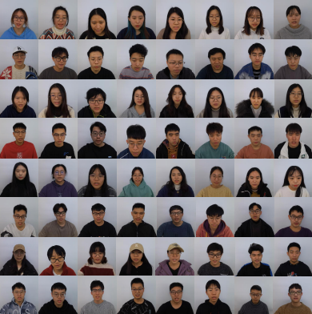

## 
MAVD: The First Open Large-Scale Mandarin Audio-Visual Dataset with Depth Information

### Introduce
In order to address the challenges of scarce open datasets and low-quality data in the field of Chinese Mandarin, our team built MAVD, a multimodal dataset containing text, audio, video, and in particular, MAVD used Microsoft's latest depth camera, Azure Kinect, to synchronize the acquisition of corresponding depth images in order to investigate the help of depth images in multimodal tasks.
 
MAVD comprising 12,484 utterances spoken by 64 native Chinese speakers, with a total duration of about 24 hours. The speakers included 35 male as well as 29 female speakers with an average age of 23 years. The reading material is our carefully selected textual statements collected from numerous open source media (Weibo, Douban, People's Daily, etc.) in Chinese usage scenarios. Four different topics were covered: daily life, news, novels, and ancient poems. After collecting all the raw corpus, we cleaned and filtered the text, and finally reviewed it manually. The percentage of each theme is roughly 10:5:4:1.

     

The MAVD was collected in a soundproof room where external noise was isolated and echoes were absorbed, as shown in the following figure. All collectors recorded data using our developed multimodal data acquisition system, with each speaker reading approximately 200 utterances. Finally, after the recording, we checked and selected all the data and annotated the speech at phoneme level by MFA.  More detailed description can be found in our paper presented in InterSpeech2023.

     

     

### Dataset Structure
In this project, a single statement example is uploaded and the MAVD specific data structure is shown in the figure below. The speaker numbers in the dataset are F/M+XX to distinguish the gender and the specific serial number. Each speaker corresponds to four folders, in which "AUDIO" holds the audio file corresponding to the speaker's reading utterance in the format of "xxx.wav" with a sampling rate of 16kHZ. 

"COLOR\_IMAGE" stores the RGB image sequence of each utterance, the image format is "xxx\_xxxxxxxxx\_color.jpg", where the first 3 characters are the image serial number, the last 9 characters are the image time stamp, the resolution is 1920 x 1080, 30fps; "DEPTH\_IMAGE" is similar to the RGB image storage format, the resolution of the depth image is 640 x 576. "TEXT" stores the text of the sentence, the pinyin and audio annotation files (textgrid).

     

### Current status and how to get MAVD
We are currently in the process of finalizing and checking MAVD and trying to invite more people to participate in the recording to further enrich the age and regional distribution of the speakers in MAVD. The complete MAVD dataset is expected to be released in October this year, and we will review your application and discuss with you about the distribution of MAVD. Thank you again for your interest.
